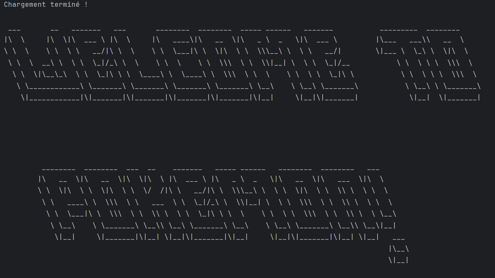
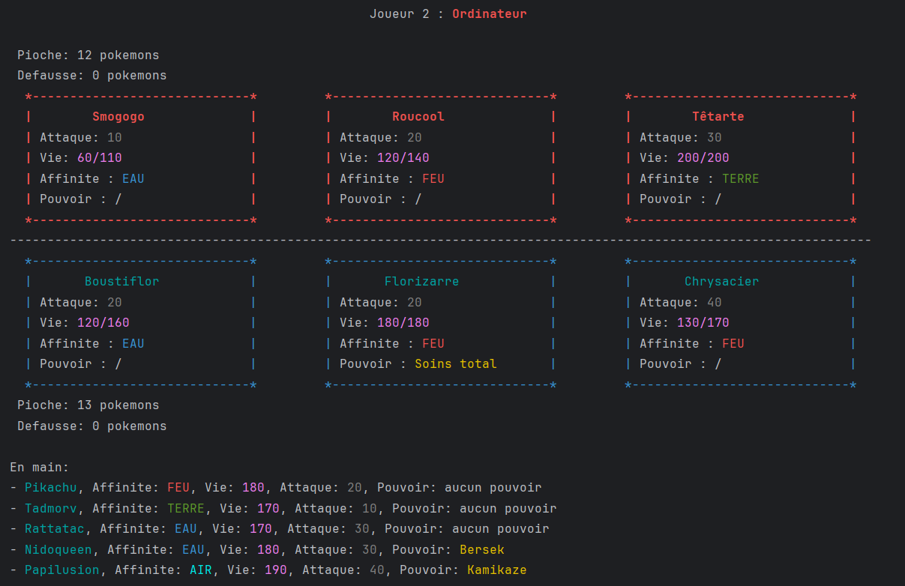

# Pokemon Project

The **Pokemon Project** is a Java application simulating a turn-based Pokémon game. This project was developed as part of a university project with specific requirements in terms of gameplay, software design, and features.

## 🎯 Project Goals
- Create a Pokémon game in Java where two players battle each other, a human and an AI.
- Implement mechanics for drawing, discarding, attacking, and managing the battlefield.
- Add a strategic dimension with **elemental affinities** and **special powers** for certain Pokémon.
- Develop the game entirely in console mode.

---

## 🚀 Implemented Features

### Core Mechanics
- **Pokémon Management:** Each Pokémon has a **name**, **life points**, **attack power**, and an **elemental affinity**.
- **Elements and Affinities:**
  - Earth > Water > Fire > Air > Earth.
  - An affinity advantage increases attack damage by 10 points, while a disadvantage decreases it by 10 points.
- **Attacks and Discards:** Pokémon attack opponents, inflicting damage based on their strength and affinity. Pokémon with 0 HP are sent to the discard pile.

### Gameplay
- **Turn-Based System:** The human player and the computer alternate their actions:
  1. Drawing Pokémon.
  2. Placing Pokémon on the battlefield.
  3. Executing attacks.
- **AI Strategy:** The computer evaluates elemental affinities and HP to determine the optimal target for its attacks.

### User Interface
- **Textual Display:** Clear visualization of Pokémon in play, Pokémon in hand, and available actions.
- **User Feedback:** AI actions are displayed to the player, along with a turn-by-turn log.

### Special Powers
- Implementation of **8 unique abilities** for specific Pokémon, such as:
  - **Resistance** (single-use): The Pokémon chooses an ally (including itself). Until the end of the game or the ally's defeat, all attacks against this Pokémon deal 10 less damage.
  - **Warrior Fervour** (single-use): The Pokémon chooses an ally (including itself). Until the end of the game or the ally's defeat, all attacks by this Pokémon deal 10 additional damage.
  - **Fear** (single-use): The Pokémon chooses an opposing Pokémon. Until the end of the game or the opponent's defeat, this Pokémon's attacks deal 10 less damage.
  - **Berserk** (single-use): The Pokémon chooses an ally (including itself). For the current turn, this Pokémon's attack damage is doubled.
  - **Intimidation** (single-use): The Pokémon chooses an opposing Pokémon. During the opponent's next turn, this Pokémon's attacks deal half damage.
  - **Full Heal** (single-use): The Pokémon chooses an ally (including itself) and fully restores its HP.
  - **Simple Heal** (usable each turn): The Pokémon chooses an ally (including itself) and restores 30 HP (without exceeding the Pokémon's original max HP).
  - **Kamikaze** (single-use): The Pokémon chooses an opposing Pokémon. Both Pokémon are then eliminated.

### Random Pokémon Generation
- **HP:** Multiples of 10, between 100 and 200.
- **Attack Power:** Multiples of 10, between 10 and 40.
- **Affinity:** Randomly selected from the four elements.
- **Names:** Randomly generated from a predefined list.

---

## 🛠️ Technical Structure

- **Language:** Java
- **Architecture:** 
  - Classes to represent the **Pokémon**, the **game**, and player actions.
  - Clear separation of responsibilities for modular and extensible design.
- **Tests:** A suite of unit tests to validate core mechanics and special powers.

---

## 🏆 Endgame

The game ends when all Pokémon of one player are defeated.

## 📚 Resources and References

A JavaDoc documentation and a UML diagram are available for further details. They can be found in the project's `uml` and `JavaDoc` directories.  
The program can be run in any IDE (I personally recommend IntelliJ IDEA).  
Alternatively, the program can be compiled manually and executed directly from the command line.

  
  

